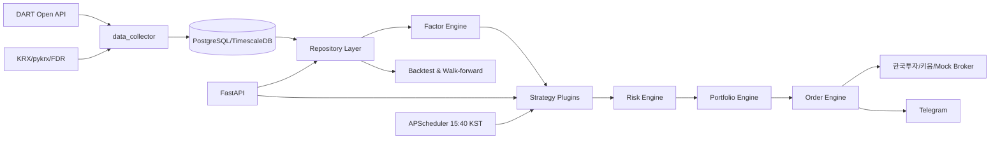
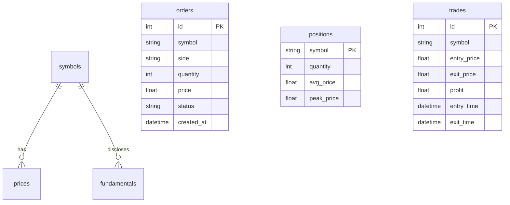
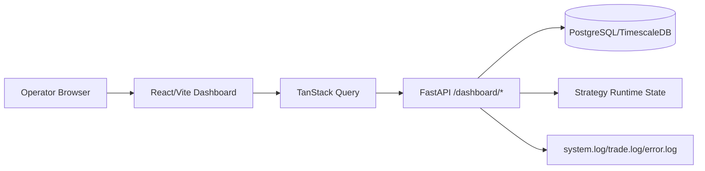

# 한국 주식 멀티팩터 퀀트 자동매매 플랫폼 설계서

## 1. 전체 아키텍처 설계서

본 플랫폼은 대한민국 개인투자자가 획득 가능한 DART, KRX, pykrx, FinanceDataReader, 한국투자 Open API 데이터를 사용해 KOSPI/KOSDAQ 보통주 멀티팩터 전략을 연구·검증·실행한다. 백테스트와 실거래는 같은 `BaseStrategy.generate_signals()` 계약을 사용하여 연구 코드와 운영 코드의 괴리를 줄인다.



Clean Architecture 경계를 적용한다.

- **Domain/ORM**: `symbols`, `prices`, `fundamentals`, `orders`, `positions`, `trades`.
- **Repository**: SQLAlchemy 세션을 캡슐화하고 시점별 유니버스와 Point-in-Time 재무 조회를 제공한다.
- **Application Services**: 팩터, 전략, 리스크, 포트폴리오, 주문, 백테스트 엔진.
- **Interfaces**: FastAPI, APScheduler, Broker adapters, Telegram.

## 2. ERD 및 DB 스키마



주요 테이블은 다음 필드를 포함한다.

- `prices(date, symbol, open, high, low, close, volume, market_cap, trading_value)`
- `symbols(symbol, name, market, sector, listing_date, delisting_date, security_type, is_spac, is_preferred, is_administrative, is_halted)`
- `fundamentals(symbol, announcement_date, fiscal_year, per, pbr, psr, pcr, ev_ebitda, roe, roa, operating_margin, debt_ratio, current_ratio)`
- `orders(id, symbol, side, quantity, price, order_type, status, broker_order_id, created_at)`
- `positions(symbol, quantity, avg_price, peak_price, updated_at)`
- `trades(id, symbol, entry_price, exit_price, profit, entry_time, exit_time)`

TimescaleDB를 사용할 경우 `prices`를 hypertable로 전환하면 일봉 대량 조회 성능을 개선할 수 있다.

## 3. 프로젝트 구조

```text
trading_system/
├─ app/
│  ├─ api/              FastAPI 엔드포인트
│  ├─ backtest/         백테스트, 성과지표, 워크포워드
│  ├─ brokers/          Broker 인터페이스, 한국투자, Mock
│  ├─ data_collector/   DART/KRX/pykrx/FDR 어댑터
│  ├─ database/         SQLAlchemy 모델, 세션, Repository
│  ├─ factors/          Value/Momentum/Quality 팩터
│  ├─ notifications/    Telegram 알림
│  ├─ orders/           주문 엔진
│  ├─ portfolio/        목표비중 주문 변환
│  ├─ risk/             손절/트레일링/시장위험 필터
│  ├─ scheduler/        15:40 KST 작업 스케줄러
│  └─ strategies/       플러그인 전략
├─ tests/               단위 및 통합 테스트
├─ config/              환경 변수 예시
├─ docs/                설계·운영 문서
├─ Dockerfile
├─ docker-compose.yml
└─ requirements.txt
```

## 4. 데이터 수집기 구현

- `PyKrxPriceCollector`: pykrx의 일봉, 거래량, 거래대금 데이터를 표준 OHLCV 스키마로 변환한다.
- `FinanceDataReaderSymbolCollector`: KRX 종목 정보를 수집하고 ETF/ETN/SPAC/우선주 제외를 위한 플래그를 생성한다.
- `DartFundamentalCollector`: DART 공시 재무제표에서 PER/PBR/PSR/PCR/EV_EBITDA, ROE/ROA/영업이익률/부채비율/유동비율을 계산하는 정규화 함수를 제공한다.

## 5. DB Repository 계층

Repository Pattern은 SQLAlchemy ORM 접근을 숨기며 테스트에서는 SQLite도 사용할 수 있게 설계했다. 핵심 메서드는 `active_universe(as_of)`, `dataframe(symbols, start, end)`, `point_in_time_dataframe(symbols, as_of)`이다.

## 6. 팩터 엔진 구현

- **Value**: PER, PBR, PSR, EV/EBITDA의 역수를 winsorize 후 z-score하고 평균한다.
- **Momentum**: 12개월 수익률에서 최근 1개월을 제외한 12-1 모멘텀을 계산한다.
- **Quality**: ROE, ROA, 영업이익률은 높을수록 우수, 부채비율은 낮을수록 우수하게 z-score한다.
- **종합 점수**: Momentum 40%, Value 30%, Quality 30%.

## 7. 전략 엔진 구현

`BaseStrategy` 추상 클래스가 플러그인 계약이다. `MultiFactorStrategy`는 상위 20개 종목을 선택하고 동일가중 5% 목표비중을 반환한다. 전략 추가 시 호출자는 `BaseStrategy` 타입만 의존하므로 기존 코드를 수정하지 않는다.

## 8. 포트폴리오 엔진 구현

현재 보유수량, 최신가, 총자산, 목표비중을 비교해 매수/매도 주문수량을 계산한다. 종목당 최대비중은 5%로 제한된다.

## 9. 리스크 엔진 구현

- 종목 손절: 평균단가 대비 -10%.
- 트레일링 스탑: 고점 대비 -15%.
- 시장 위험 회피: KOSPI200 MA50 < MA200이면 신규 포지션을 금지하고 현금 100% 상태로 전환한다.

## 10. 백테스트 엔진 구현

T일 종가로 신호를 생성하고 T+1 시가에 체결한다. 수수료 0.015%, 슬리피지 0.10%, 매도 거래세 기본값 0.18%를 반영한다. 성과지표는 CAGR, MDD, Sharpe, Sortino, Calmar, Information Ratio, Turnover, Win Rate를 산출한다.

## 11. 워크포워드 엔진 구현

Train 3년/Test 1년 창을 생성한다. 예: 2014~2016 학습, 2017 테스트; 2015~2017 학습, 2018 테스트. 현재 기본 전략은 고정 가중치 전략이며 `parameter_sweep()`으로 Momentum Weight 20~60% 민감도를 점검한다.

## 12. 브로커 인터페이스 구현

`Broker`는 `buy`, `sell`, `cancel`, `positions`, `balance`를 정의한다. `MockBroker`는 테스트와 모의투자용이며 `KoreaInvestmentBroker`는 한국투자 Open API 토큰 발급과 현금주문 엔드포인트를 구현한다. 키움 OpenAPI는 같은 인터페이스를 구현하는 별도 어댑터로 추가 가능하다.

## 13. 한국투자 Open API 구현

환경변수 `KIS_APP_KEY`, `KIS_APP_SECRET`, `KIS_ACCOUNT_NO`, `KIS_BASE_URL`을 사용한다. 실전/모의 URL과 TR ID는 계정 환경에 맞춰 설정해야 하며 주문 전 계좌 권한과 상품코드를 검증한다.

## 14. 주문 엔진 구현

Order Engine은 시장가/지정가 주문 요청을 Broker에 비동기로 전달하고 주문 상태를 DB에 저장한다. 체결·주문 이벤트는 Loguru의 `trade.log`에 기록된다.

## 15. FastAPI 서버 구현

필수 엔드포인트를 제공한다.

- `GET /health`
- `GET /portfolio`
- `GET /positions`
- `GET /orders`
- `GET /trades`
- `GET /backtest`
- `GET /factors`
- `POST /strategy/run`
- `POST /rebalance`

## 16. Telegram 알림 구현

`TelegramNotifier.send()`가 매수/매도 체결, 손절, 리밸런싱 완료, 오류 메시지를 보낸다. 토큰이 없으면 운영 로그만 남겨 로컬 개발을 방해하지 않는다.

## 17. Docker 환경 구성

`docker-compose.yml`은 TimescaleDB 기반 PostgreSQL과 FastAPI 서비스를 실행한다.

```bash
docker compose up --build
```

## 18. 테스트 코드 작성

테스트는 팩터 계산, 생존자 편향 제거, 룩어헤드 방지, 백테스트, API 헬스체크 통합 시나리오를 포함한다.

## 19. 운영 매뉴얼

1. `.env`를 `config/settings.example.env` 기반으로 작성한다.
2. `docker compose up --build`로 DB/API를 시작한다.
3. DART/KRX/pykrx/FDR 수집기를 배치 작업으로 실행해 원천 데이터를 적재한다.
4. `/factors`와 `/strategy/run`으로 신호를 검증한다.
5. 모의투자 Broker로 최소 1개월 이상 리밸런싱·주문·알림을 검증한다.
6. 실계좌 전환 전 최종 체크리스트를 모두 통과한다.

## 20. 무료 데이터만 사용할 때의 한계 분석

- DART 재무 데이터는 계정과목 매핑이 회사별로 달라 직접 정제가 필요하다.
- KRX/pykrx/FDR 데이터는 결측, 수정주가 정책 차이, 상장폐지 이력 누락 가능성이 있다.
- 과거 시점의 관리종목/거래정지/업종/시가총액 복원이 어렵다.
- Point-in-Time 재무 데이터는 `announcement_date`를 직접 관리해야 하며 재작성·정정공시 처리가 필요하다.
- 팩터 계산 품질은 원천 데이터 정합성과 직접 구현한 회계 로직에 좌우된다.

## 21. 유료 데이터 사용 시 개선점 분석

DataGuide, FnGuide, Quantiwise 같은 유료 데이터는 정제 재무지표, 상장폐지 포함 유니버스, 과거 구성종목, Point-in-Time 데이터, 표준 팩터 데이터를 제공할 수 있다. 플러그인 데이터소스가 같은 Repository 스키마에 적재하면 무료 데이터 기반 시스템을 변경하지 않고 품질을 개선할 수 있다.

## 22. 생존자 편향 제거 방식 설명

현재 종목 리스트를 백테스트 전체 기간에 적용하지 않는다. `symbols.listing_date <= as_of - 6개월`이고 `delisting_date is null or delisting_date > as_of`인 종목만 시점별 유니버스에 포함한다. 상장폐지 종목은 반드시 `symbols`와 `prices`에 보존한다.

## 23. 룩어헤드 바이어스 제거 방식 설명

재무 데이터는 결산일이 아니라 `announcement_date` 기준으로만 사용한다. 예를 들어 2024년 사업보고서가 2025년 3월에 공시되면 2025년 3월 공시일 이후 리밸런싱부터만 사용된다. 백테스트 신호는 T일 종가로 생성하고 체결은 T+1 시가로 처리한다.

## 24. 워크포워드 결과 해석 방법 설명

각 테스트 연도의 CAGR, MDD, Sharpe가 특정 기간에만 과도하게 의존하는지 확인한다. Momentum Weight 20~60% sweep의 heatmap에서 넓은 구간이 양호하면 robust, 한 점만 우수하면 과최적화 가능성이 높다. Test 성과가 Train 성과보다 급격히 낮으면 거래비용, 유동성, 팩터 붕괴, 데이터 품질을 재검토한다.

## 25. 실거래 투입 전 최종 검증 체크리스트

- 상장/상장폐지/관리/거래정지 상태가 리밸런싱 시점 기준으로 복원되는가?
- 모든 재무 팩터가 `announcement_date` 이후에만 사용되는가?
- T+1 시가 체결과 거래비용이 백테스트에 반영되는가?
- 한국투자 모의투자에서 시장가, 지정가, 취소, 체결조회가 정상 동작하는가?
- Telegram 오류 알림과 `error.log`가 장애를 놓치지 않는가?
- 주문수량이 종목당 5%, 유동성, 최소주문단위 제약을 만족하는가?
- 월말 거래일 계산과 휴장일 처리가 실제 KRX 캘린더와 일치하는가?
- Docker 재배포 후 DB 마이그레이션과 환경변수가 재현 가능한가?

## 26. Web Dashboard 시스템

Dashboard는 `dashboard/` 하위의 React + TypeScript + Vite 애플리케이션이며 TanStack Query로 FastAPI 상태를 폴링하고 Zustand로 메뉴 상태를 관리한다. Tailwind CSS는 운영 화면 레이아웃과 경고 표시를 담당하고 Recharts는 포트폴리오 가치, 섹터 비중, Equity Curve, Drawdown을 시각화한다.



Dashboard 메뉴는 다음 운영 목적을 가진다.

- **Overview**: 총자산, 예수금, 평가손익, 보유 종목 수, 현금/투자 비중, DB/API/Broker/Scheduler 상태를 표시한다.
- **Portfolio**: 보유 종목 테이블, 포트폴리오 가치 추이, 섹터 비중 파이차트를 제공한다.
- **Orders**: 당일/7일/30일 주문 추적을 위한 주문시간, 종목, 매수·매도, 주문수량, 체결수량, 체결가격, 상태를 제공한다.
- **Trades**: 진입/청산일, 보유기간, 수익률, 손익 및 승률, 평균 수익, 평균 손실, Profit Factor를 표시한다.
- **Factors**: Momentum, Value, Quality, Total Score와 Top 20 리밸런싱 후보를 표시한다.
- **Backtest**: CAGR, MDD, Sharpe, Sortino, Calmar, Equity Curve, Drawdown, 연도별/월별 성과를 조회한다.
- **Walk Forward Analysis**: 3년 학습/1년 테스트 구간별 CAGR, MDD, Sharpe와 평균 성과를 조회한다.
- **Risk Dashboard**: 현재 MDD, 종목 집중도, 현금 비중, 섹터 편중도, 변동성, 손절·MDD·리밸런싱 경고를 표시한다.
- **Rebalance Center**: 현재 포트폴리오와 예상 포트폴리오를 비교하고 매수/매도 예정 주문을 시뮬레이션하거나 실행 요청한다.
- **System Logs**: `system.log`, `trade.log`, `error.log`를 검색한다.
- **Admin**: 전략 ON/OFF, 전략 중지/재개, Emergency Stop, Paper Trading, 실거래 전환, 손절·팩터 가중치·종목 수·리밸런싱 주기를 관리한다.

추가 FastAPI 엔드포인트는 `/dashboard/overview`, `/dashboard/portfolio`, `/dashboard/orders`, `/dashboard/trades`, `/dashboard/factors`, `/dashboard/risk`, `/dashboard/backtest`, `/dashboard/walkforward`, `POST /dashboard/rebalance`, `POST /dashboard/strategy/{action}`, `POST /dashboard/emergency-stop`, `/dashboard/logs`, `POST /dashboard/admin/settings`이다.

## 27. Dashboard 빌드 및 실행

로컬 개발:

```bash
cd dashboard
npm install
npm run dev
```

Docker Compose 실행 시 `api`는 `8000`, `dashboard`는 `5173` 포트로 기동된다. Dashboard는 `VITE_API_BASE_URL=http://localhost:8000`을 사용해 FastAPI에 연결한다.

## 28. 유지보수 문서와 빌드 가이드

유지보수자는 전략/데이터/리스크/주문 로직을 변경하기 전에 `docs/business_logic.md`를 먼저 확인해야 한다. 해당 문서는 유니버스 선정, 팩터 계산, 전략 신호, 리밸런싱, 리스크 관리, 백테스트, 주문, Emergency Stop의 불변 규칙과 회귀 테스트 기준을 정의한다.

전체 저장소 구조, Docker Compose 실행, Backend/Frontend 로컬 개발, 테스트, 초기 데이터 적재, 운영 배포 체크리스트는 `docs/build_guide.md`에 정리되어 있다. 신규 개발자는 README를 시작점으로 삼고, 상세 설계는 `docs/architecture.md`, 유지보수 규칙은 `docs/business_logic.md`, 실행 절차는 `docs/build_guide.md`를 순서대로 확인한다.
